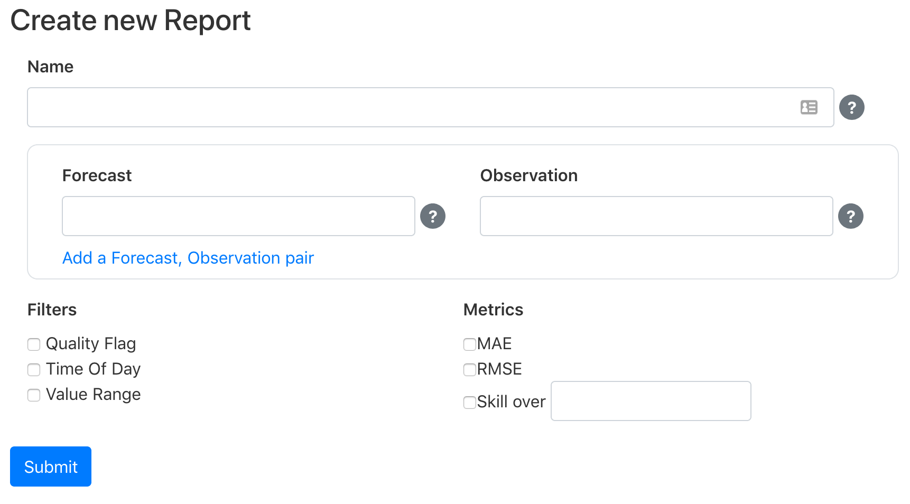

# Reports

The Solar Forecast Arbiter's reports are the primary outputs of the project. The reports compare one or more observations to one or more forecasts. The reports include graphics and metrics that support users in determining the relative merits of forecasts.

The reports functionality currently addresses the following [use cases](https://solarforecastarbiter.org/usecases/):

* Compare a forecast to measurements
* Compare multiple forecasts to measurements

## Create new report

Go to the dashboard's [reports page](https://dashboard.solarforecastarbiter.org/reports/) to create a report. Clicking *Create new Report* will display a form that allows you to input the metadata that describes a new report.

The report requires a descriptive name such as "Utility X Q1 analysis". Users select forecast and observation pairs by selecting a site, then a forecast, then an observation. The forecast and observation must be for the same variable (GHI, AC power, etc.) and for the same site. The forecast and observation are not required to have the same interval length or labeling -- the Solar Forecast Arbiter follows documented rules for resampling and aligning observation and forecast data. Additional forecast and observation pairs may be added by clicking "Add a Forecast, Observation pair". The pairs may be from different sites.

In the future, filters may be specified that control what data is allowed or disallowed in the calculation:

* Quality Flag: include or exclude points based on data validation results.
* Time of Day: evaluate forecasts when the time of day is between two times and/or evaluate forecasts for specified subdivisions of time (e.g. monthly, daily, hourly).
* Value Range: evaluate forecasts when an observation is between two values.

Metrics to be calculated may be selected and an option will be provided to select a forecast for a skill metric. The existing list is incomplete and is only for demonstration.

Once the report metadata is complete, the user clicks *Submit* and the Solar Forecast Arbiter queues up the report calculation. The report calculation may take seconds to minutes. For the initial release, the user must manually refresh the [reports page](https://dashboard.solarforecastarbiter.org/reports/) to check the status of the report calculation.

## View report

Click a report name from the [reports page](https://dashboard.solarforecastarbiter.org/reports/) to view the analysis.

The report first displays the metadata that was used to specify its contents. The top section also contains links to download the report in HTML or PDF formats (not yet implemented).

A **Data** section summarizes the operations that were applied to align and resample the observation and forecast data. Time series and scatter plots display the observation and forecast data. The graphs are interactive and allow the user to zoom, pan, and save static images. A *data validation* sub-section summarizes any issues identified in the raw data and the strategy employed for addressing them.

Next, the **Metrics** section displays tables and graphs of the desired metrics. These graphs and tables are also interactive. Metrics are broken into subsections for total analysis period and monthly, daily, and hourly groupings.

A **Versions** section summarizes the versions of all relevant packages used in the creation of the report.

Finally, a **Hash** section contains information that allows a user to verify that the report was created by solarforecastarbiter.org (not yet implemented).
